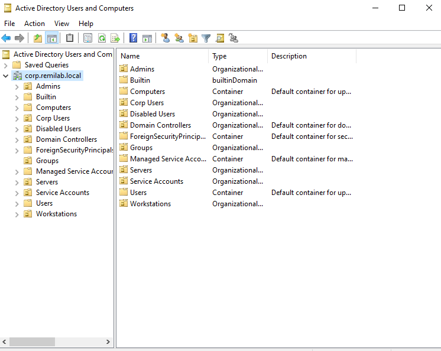
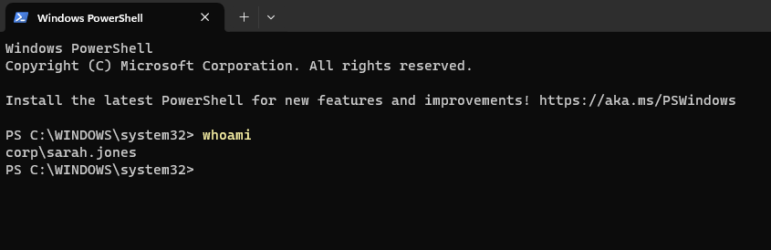
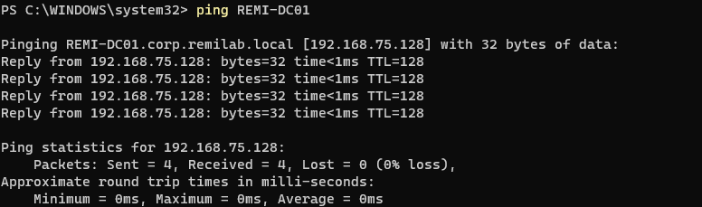
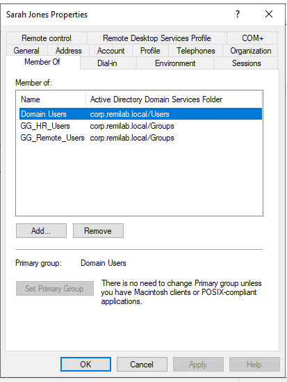
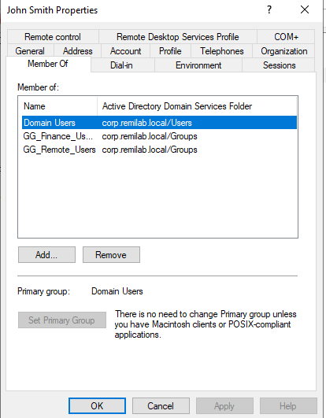
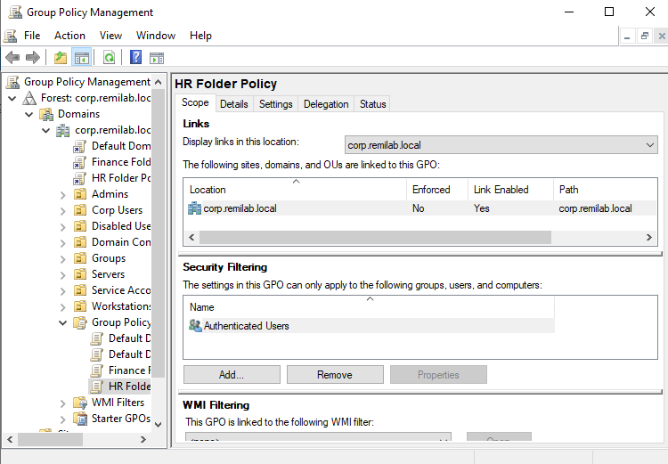
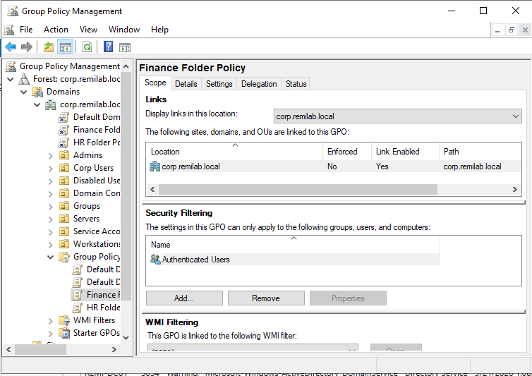
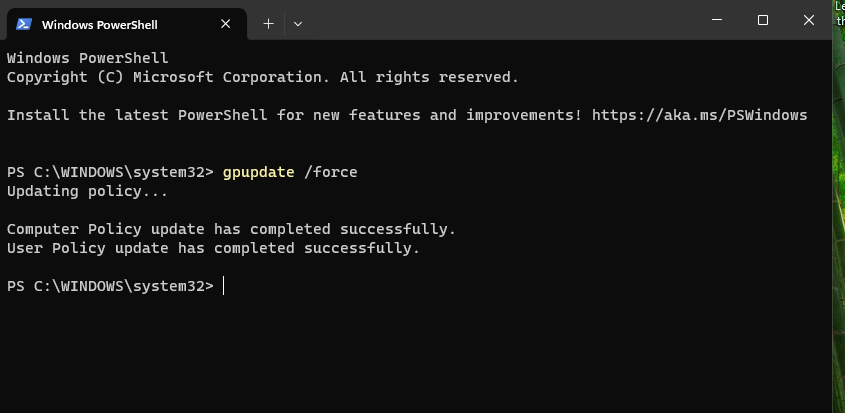

# Hybrid IAM + Active Directory Lab

Enterprise-style Active Directory and IAM lab built with Windows Server 2022, VMware Workstation, Group Policy, RBAC security groups, SMB shares, and Windows 11 domain-joined clients.

---

# Lab Overview

This project simulates a real-world enterprise Windows environment focused on:

- Active Directory Domain Services (AD DS)
- Identity & Access Management (IAM)
- DNS configuration and troubleshooting
- Windows 11 domain joins
- Organizational Units (OUs)
- Security Groups
- SMB shared folders
- NTFS permissions
- Role-Based Access Control (RBAC)
- Group Policy Objects (GPOs)
- Group Policy Preferences (GPP)
- Automated drive mapping
- Windows Server 2022 administration
- Enterprise troubleshooting scenarios

The lab was built entirely in VMware Workstation Pro using Windows Server 2022 and Windows 11 Enterprise.

---

# Lab Architecture

## Domain Controller

| Component | Details |
|---|---|
| Hostname | REMI-DC01 |
| OS | Windows Server 2022 |
| Roles | AD DS, DNS |
| IP Address | 192.168.75.128 |
| DNS | 127.0.0.1 |
| Network Type | VMware NAT |

---

## Client Workstation

| Component | Details |
|---|---|
| Hostname | REMI-CL01 |
| OS | Windows 11 Enterprise |
| IP Address | 192.168.75.129 |
| DNS Server | 192.168.75.128 |
| Domain Joined | Yes |

---

# Active Directory Structure

## Organizational Units (OUs)

```text
Corp Users
├── HR
├── Finance
├── IT

Corp Computers
├── Workstations
├── Servers
```

---

## Security Groups

| Group Name | Purpose |
|---|---|
| GG_HR_Users | HR department access |
| GG_Finance_Users | Finance department access |
| GG_IT_Admins | IT administrative access |
| GG_Remote_Users | Remote access permissions |
| GG_Workstation_Admins | Workstation administration |

---

## User-to-Role Mapping

| User | Department | Security Groups |
|---|---|---|
| Sarah Jones | HR | GG_HR_Users |
| John Smith | Finance | GG_Finance_Users |
| remi.admin | IT | GG_IT_Admins, GG_Workstation_Admins |

---

# File Shares and RBAC Validation

Created department-based SMB shares with NTFS and Share permissions enforced through Active Directory Security Groups.

## Shared Folders

| Share | Security Group | Drive Letter |
|---|---|---|
| \\REMI-DC01\Finance$ | GG_Finance_Users | F: |
| \\REMI-DC01\HR$ | GG_HR_Users | H: |

---

## Validation Results

### Finance Access
- John Smith successfully accessed Finance drive.
- Finance drive mapped automatically using GPO.

### HR Access
- Sarah Jones successfully accessed HR drive.
- HR drive mapped automatically using GPO.

### RBAC Enforcement
- Sarah Jones received Access Denied when attempting to access Finance share.
- Security group filtering and NTFS permissions validated successfully.

---

# Group Policy Objects (GPOs)

## Configured Policies

| GPO | Purpose |
|---|---|
| Finance Folder Policy | Maps Finance drive (F:) |
| HR Folder Policy | Maps HR drive (H:) |
| Password Policy | Password complexity and aging |
| Account Lockout Policy | Lockout after failed login attempts |

---

## GPO Features Used

- User Configuration
- Preferences
- Drive Maps
- Security Group Filtering
- Item-Level Targeting

---

# Networking and DNS

## DNS Configuration

| Device | DNS Configuration |
|---|---|
| REMI-DC01 | 127.0.0.1 |
| REMI-CL01 | 192.168.75.128 |

---

## Networking Validation

Validated:
- DNS resolution
- Domain controller communication
- SMB share connectivity
- Group Policy application
- Domain authentication

---

# Validation Commands

## Verify Logged-In User

```powershell
whoami
```

## Verify DNS Resolution

```powershell
nslookup corp.remilab.local
```

## Verify Domain Controller Connectivity

```powershell
ping REMI-DC01
```

## Force Group Policy Update

```powershell
gpupdate /force
```

## Verify Mapped Drives

```powershell
net use
```

## Verify Applied GPOs

```powershell
gpresult /r
```

---

# Troubleshooting and Lessons Learned

## Issues Resolved

- DNS misconfiguration preventing domain join
- Broken trust relationship between client and domain
- VMware NAT networking conflicts
- Duplicate IPv4 addressing
- Incorrect SMB share paths
- GPO not applying due to missing domain link
- Drive mapping issues caused by incorrect targeting

---

## Key Takeaways

- Active Directory heavily depends on DNS.
- Domain clients should use the Domain Controller as their DNS server.
- GPOs must be linked to domains or OUs to apply.
- NTFS permissions and Share permissions must align properly.
- RBAC simplifies scalable enterprise permission management.

---

## Screenshots

| Area | Screenshot |
|---|---|
| Active Directory Structure |  |
| Successful Domain Login |  |
| Verify Logged-In Domain User |  |
| Verify Domain Controller Connectivity |  |
| Sarah Jones Group Membership |  |
| John Smith Group Membership |  |
| HR Drive Mapping GPO |  |
| Finance Drive Mapping GPO |  |
| Group Policy Update Validation |  |

---

# Technologies Used

- Windows Server 2022
- Windows 11 Enterprise
- VMware Workstation
- Active Directory Domain Services (AD DS)
- DNS
- Group Policy Management
- SMB File Sharing
- NTFS Permissions
- PowerShell

---

# Future Improvements

- Add Azure AD / Entra ID Hybrid Integration
- Configure Microsoft Intune policies
- Deploy Windows Admin Center
- Add PowerShell automation scripts
- Implement LAPS
- Configure WSUS
- Add SIEM logging and monitoring
- Build secondary Domain Controller

---

# Author

Remi Olarewaju

LinkedIn:
www.linkedin.com/in/oluwaremi-olarewaju

GitHub:
https://github.com/R3mster
